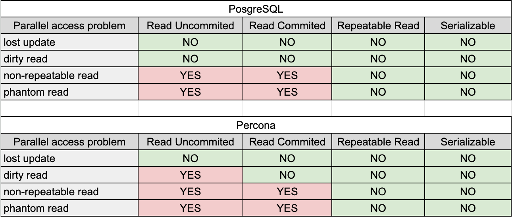

# Transactions and isolation and Transactional Anomalies

### Storage Engines
 - PostgreSQL supports and uses just only one storage engine - PostgreSQL
 - Percona supports several storage engines. InnoDB is used in our testing

### Instructions
1. Run `docker-compose up` so PostgreSQL and Percona containers start
2. Connect to the bank_database for each PostgreSQL and Percona
3. For each datasource open two consoles that will serve for different transactions
4. Perform testing using the queries from `postgres-transactions.txt` and `percona-transactions.txt`

### Is parallel access problem reproducible for isolation level?

